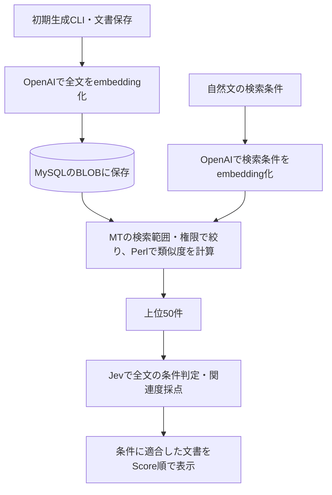

# 自然言語検索への置き換え実装計画（PoC）

作成日: 2026-09-22

## 作るもの

既存の管理画面のJev検索を、**OpenAIのembeddingで候補を取得し、Jevで条件への適合と関連度を評価する検索**に置き換える。1万件の全文を検索のたびにJevへ送らず、既定では上位50件を評価する。

対象はMT9以降の `__mode=search_replace` とグローバルヘッダーの検索フォーム。プラグインIDは `Jev` のまま、検索オプション名を「自然言語で検索」に統一する。

**デモ用のシンプルなPoCとする。生成中断、更新失敗、未生成による検索漏れを許容し、ジョブ管理・自動復旧・進捗や再開画面は作らない。** 基本的な権限確認、APIキーの保護、APIのタイムアウトは維持する。

この計画をJev 0.2.0として実装した。動作確認と未検証の範囲は[検証記録](natural-language-search-verification.md)を参照。[従来の検索計画](jev-search-implementation-plan.md)の全件Jev評価方式を更新し、[mt:JevEntriesの計画](jev-entries-implementation-plan.md)は保留する。

## 確認済みの要件

| 項目 | 決定内容 |
| --- | --- |
| 対象 | 記事・ウェブページ・コンテンツデータ |
| embedding | `text-embedding-3-large` の同期API。OpenAI Batch APIは使わない |
| 文書の単位 | 検索対象の全項目を合わせた1文書。細かいチャンク分割やLLMによる事前要約はしない |
| Jevの評価 | 候補全文で否定・不在の条件も判定する。順位にはScoreを使う |
| 候補数 | embedding上位50件が既定値。設定で変更可能。自動で全件評価に広げない |
| APIキー | TypeSafeキーに加え、OpenAIキーをプラグイン設定に追加 |
| 初期生成 | アップグレードでは生成しない。キー設定後に生成する方式に統一 |
| 項目指定 | 自然言語検索では「項目を指定する」を無効にし、全項目で候補取得・判定 |
| UI | 検索画面・ヘッダーとも「自然言語で検索」 |
| ヘッダー既定値 | 既存のON/OFF設定を維持。既定はON |
| 作り込み | 運用の堅牢性より、単純に動くPoCを優先 |

以下のCLI、保存時更新、次元数などは、この方針を具体化する初版案とする。

## 処理の流れ



文書のembeddingは事前に保存する。検索時のOpenAI呼び出しは検索条件のembedding化だけ。検索時にTypeSafeへ送るのは、検索条件と選ばれた候補の全文である。

## 設定と検索UI

APIキー欄はAI-Assistantと現行Jevを踏襲し、「更新」を選んだ場合だけ編集し、保存済みキーは末尾4文字を表示する。未編集なら既存値を維持し、HTML・JavaScript・ログにキー全文を出さない。設定はシステム共通とする。

| 設定・定数 | 初版の扱い |
| --- | --- |
| `openai_api_key` | 新設。OpenAI APIキー |
| `jev_api_key` / `jev_model` | 現行設定を継続 |
| `jev_candidate_limit` | 新設。既定50、整数1〜500。Jevで評価する総文書数 |
| `jev_batch_size` | 既定5、現行の1〜50を継続。1回にまとめる文書数 |
| `jev_threshold` | 現行の既定0.5を継続。Noulの条件適合判定に使う |
| `jev_header_default` | 名前・保存値を維持し、画面表示を「ヘッダー検索で自然言語検索を標準で使用」に変更 |
| embeddingモデル・次元 | 初版は `text-embedding-3-large` / 3072次元で固定 |
| 検索期限 | 現行の45秒。OpenAI・候補取得・Jevを含む全体に適用 |
| HTTP期限 | 現行と同じく1回10秒を基本とし、処理全体の残り時間内に収める |

3072はモデルの標準次元数。初版では次元削減の設定画面を作らず、検索条件と文書に同じ設定を使う。[OpenAI embedding guide](https://developers.openai.com/api/docs/guides/embeddings)

自然言語検索ON時は、大小文字・正規表現・項目指定・置換を無効にする。サーバー側でもこれらのパラメーターを検索に適用せず、置換リクエストは拒否する。サイト・日付・公開状態などの標準条件は維持する。OFFなら標準検索・置換へ戻す。

ヘッダーの入力欄直下にも「自然言語で検索」を表示し、詳細検索への状態引き継ぎを維持する。内部パラメーター `is_jev` は変更しない。非対応の検索種類は従来どおり通常検索を使う。

検索画面の説明は「生成済みの検索用データから、意味の近い上位50件を評価します」のように、候補数設定を反映した短い文にする。未生成・更新失敗の件数集計や復旧案内画面は作らない。索引がなければ生成が必要な旨を表示する。

## 文書化と入力制限

既存 `MT::Plugin::Jev::Content` に索引用の文書化を追加する。

- 記事・ページは `search_apis.search_cols` の全項目。コンテンツデータは同レジストリと、その型の `searchable_fields` を使う。
- 項目名・ラベル・値を固定順で並べ、同じ内容なら同じテキストとSHA-256になるようにする。索引の表現はログインユーザーの言語に依存させない。
- HTMLは既存の `plain_text` を再利用し、script/styleを除去し、画像altを含める。本文を要約・切り捨てしない。
- 選択肢は値と表示名、カテゴリー・タグは同じサイトのIDと名称を含める。
- アセット・別コンテンツデータへの参照は、共有embeddingにはIDのみを含める。参照先を検索できない利用者も元データを検索できるため、参照先の表示名を共有ベクトルに埋め込まない。データラベルが参照型由来の場合も同じ扱いにする。
- Jevに送る際は、既存と同様に参照先の権限を確認して表示名を補足できる。ただし、参照先の表示名だけに一致する候補をembeddingで拾えるとは保証しない。
- 添付ファイルの内容、リンク先、参照先の本文、MT標準検索の対象外フィールドは読まない。「全文」はこの検索用に抽出した全項目を意味する。

OpenAIの入力上限は1文書8192トークン、1リクエスト合計300,000トークン。初期生成は文書ごとに1回呼ぶ単純なループとし、トークナイザーやバッチ生成の依存を増やさない。上限超過はAPIエラーとして停止する。空文書は生成しない。[Embeddings API reference](https://developers.openai.com/api/reference/resources/embeddings/methods/create)

Jevには既存の1候補24,000バイト・1リクエスト48,000バイトのJSON制限を残す。2質問方式の送信JSONで計測し、長すぎる場合は検索をエラーにする。項目指定を無効にするので、従来の「項目を減らしてください」は長さの制限を示すメッセージに変更する。長文対応や自動救済はPoCに含めない。

## 保存先と生成方法

### テーブルは1つ

`schema_version: 0.01` と `object_types.jev_embedding: MT::Plugin::Jev::Embedding` を追加する。通常の `MT::Object` とMySQLのBLOBを使い、専用ベクトルDBやVECTOR型を要求しない。API呼び出し用の `upgrade_functions` は登録しない。[独自オブジェクトの公式ガイド](https://github.com/movabletype/Documentation/wiki/Japanese-plugin-dev-4-1)

`jev_embedding` のカラムは次に留める。

| 属性 | 用途 |
| --- | --- |
| `id`, `object_type`, `object_id` | 元データとの対応。`(object_type, object_id)` を一意にする |
| `blog_id`, `content_type_id` | 対象範囲の絞り込み |
| `source_hash` | 生成済み内容との比較 |
| `model`, `dimensions`, `text_version` | embeddingの設定と文書化仕様の識別 |
| `vector` | little-endian float32のBLOB。`pack('f<*')` / `unpack('f<*')` |

本文のコピー、ジョブ、処理状態、エラー履歴、リース、進捗カウンターは保存しない。ベクトルの次元・有限数・非ゼロノルムを検証し、float32化後もコサイン類似度を正しく計算できるように正規化する。[OpenAI embedding guide](https://developers.openai.com/api/docs/guides/embeddings)

### 初期生成はCLI

`tools/Jev/build-index` を追加し、配布・導入時はMTルートの `tools/Jev/` に配置する。MT本体を読み込む標準的なCLIの初期化を使い、MTに保存したOpenAIキーを読む。キーをコマンド引数に渡さない。実行例はMTルートで `perl tools/Jev/build-index --blog-id 1` とする。

- 記事・ページ・コンテンツデータを順に走査する。記事とページのクラス条件を分け、同じ文書を二重生成しない。
- デモの対象を絞れるよう、任意の `--blog-id` と `--type` を用意する。省略時は全サイト・3種類が対象。
- 現在のハッシュと設定が保存済みベクトルと一致すればスキップし、それ以外は同期APIで生成して保存する。
- 生成件数を標準出力へ出し、APIエラーが発生したら対象IDを表示して停止する。別途のエラー一覧や再開トークンは作らない。
- 再実行では最初から走査する。成功済みの同じ内容はスキップするだけでよい。必要なら `--force` で全件を再生成できるようにする。

大量データを管理画面の1リクエストで生成する実装は避け、設定画面とREADMEからCLIの使い方を案内する。CLIは同期APIを順番に呼ぶもので、OpenAIのBatch APIやバックグラウンドワーカーではない。生成操作に外部送信とAPI利用料が伴うことを説明する。

### 保存・削除時

`MT::Entry::post_save`、`MT::Page::post_save`、`MT::ContentData::post_save` から、同じ文書化・生成処理を呼ぶ。ハッシュが同じならAPIを呼ばない。キー未設定時は生成しない。内容が変わった古いベクトルは破棄してから生成し、失敗時は未索引のままにする。

`post_remove` で対応する索引を削除する。生成時のエラーは通常のMTのログ・エラー処理に任せ、自動再試行ジョブは作らない。APIのために本文保存をロールバックする仕組みも追加しない。

参照名・フィールド定義変更の依存関係追跡、インポート専用の最適化、生成中の同時編集への排他制御は作らない。必要ならCLIを再実行する。検索では現在の内容とハッシュが一致しないベクトルや、元データのないベクトルを使わない。生成漏れ・更新失敗があっても残る文書でデモできればよい。

## 検索の実装

### embeddingで上位候補を取得

1. 検索条件、両APIキー、対象種類を確認する。画面表示だけ・空の検索語ではAPIを呼ばない。
2. 現行MTが組み立てたサイト・日付・公開状態・所有者・コンテンツタイプの条件で元データを走査する。
3. `search_apis.perm_check` を適用し、検索権限のある文書のうち、現在の内容・モデル・次元・文書化仕様と一致する保存済みベクトルを対象にする。
4. 自然文全体を1回embedding化し、Perlで内積を計算する。類似度の下限は設けず、設定した上位K件を選ぶ。
5. 候補の現在の権限を確認して全文をJevへ渡す。未生成や古い索引の文書を検索中に生成しない。

**権限確認はtop-Kの選択より前に行う。** 全サイトの上位50件を選んでから権限で削る実装にはしない。BLOBは少量ずつ読み、全ベクトルを巨大なPerl配列として保持しない。

3072次元のfloat32は1件12,288バイト、1万件で約123MBのベクトル本体になる。DBの付帯情報とPerlのメモリは別にかかる。検索は全対象のベクトルを比較するので、外部API費用は抑えてもDB読込と計算は件数に比例する。

否定語の機械的な削除や、別LLMによる検索語の生成は行わない。「Aについて、Bに言及していない」も原文で候補を取得する。不在条件だけの検索は特に候補漏れがあり得る。候補内の結果であり、全件から漏れなく見つかる検索とはしない。

### JevのNoulとScore

候補ごとに次の2質問を同じリクエストに含める。既存の適合判定を保ち、順位をScoreにするための初版案である。

- **Noul**: 否定を含む検索条件全体を満たすか。現行 `jev_threshold` 未満を除外する。
- **Score**: 検索意図に対する関連度。5段階のcriteriaを設け、返された0〜4の小数値を並べ替えに使う。

文書は `state.documents` に一度だけ入れ、両質問のinstructionsで対象のパスを明示する。質問ID自体はモデルに渡らないため、IDだけで対象を指定しない。文書内の指示や他の文書を判断材料として混ぜない。[TypeSafe API reference](https://docs.typesafe.ai/api)

Scoreの基準は「求める情報がない」「名前だけが現れる」「周辺情報がある」「求める情報を直接説明する」「求める情報が文書の中心として具体的に説明される」を出発点に実例で調整する。不在条件だけの場合は、対象語がないことを関連度の低さとせず、適合候補が同点でもよい。Score用のしきい値設定は初版に追加しない。

並び順は **Score降順 → embedding類似度降順 → 種類・ID昇順**。Noulやconfidenceを関連度として使わない。NoulとScoreは独立した回答なので、フィルターと並べ替えはPerlで行う。[Noul](https://docs.typesafe.ai/primitives/noul)、[Score](https://docs.typesafe.ai/primitives/score)

現行のサイズによる分割送信を流用する。回答の型・ID・数値を検証し、APIエラーや期限超過なら検索をエラーにしてよい。自動的な全件検索、候補の追加取得、失敗分の再評価、永続検索キャッシュは実装しない。

### 標準検索結果への接続

現行 `MT::Plugin::Jev::CMS::init_app` のラッパーを継続する。`Search::run` 内の `make_terms` / `incremental_iter` の一時差し替えにより、自然文のSQL部分一致を外して標準の検索範囲を利用する。

現在の `_matching_iter` を、ベクトル候補取得→Jev評価→関連度順のiteratorへ置き換える。すべての候補を評価してソートしてから、MTの表示件数上限を適用する。`make_terms` が呼ばれない独自のterms/args経路でも項目を確定し、コンテンツタイプ未指定時は文書ごとに型を解決する。

一時差し替えとパラメーターは例外時にも復元する。通常検索とPSGIの後続リクエストに影響を残さない。

## 拡張ポイントと参考実装

| 目的 | 使用箇所 | ガイド・参考 |
| --- | --- | --- |
| APIキーと設定 | `settings`, `system_config_template`, `save_config_filter.Jev` | AI-Assistant・現行Jev。[設定](https://github.com/movabletype/Documentation/wiki/Japanese-plugin-dev-3-1) |
| ベクトルの保存 | `schema_version`, `object_types`, `install_properties` | AI-AssistantのChatHistory、SharedPreview。[独自オブジェクト](https://github.com/movabletype/Documentation/wiki/Japanese-plugin-dev-4-1) |
| 文書の保存・削除 | `callbacks` のモデル `post_save` / `post_remove` | MT9の `MT::Object::call_trigger` と `MT::ContentData::save`。[コールバック](https://github.com/movabletype/Documentation/wiki/Japanese-plugin-dev-3-2) |
| 検索UI | 現行の `template_source.search_replace`, `template_param.search_replace`, `template_param.header` | 現行Jev・同梱ContentInfoWidget。[Transformer](https://github.com/movabletype/Documentation/wiki/Japanese-plugin-dev-4-3) |
| 検索の差し替え | 現行 `MT::App::CMS::init_app` 内ラッパー | 現行MT9 `lib/MT/CMS/Search.pm` |

設定・テーブル・モデルフックは公式の拡張機構を使う。候補評価を置き換える専用フックが現行コアにない部分は、既存の関数差し替えを継続し、コアファイルは変更しない。

現物の参照先:

- [AI-Assistantの設定定義](/Users/taku/src/github.com/movabletype/mt-plugin-AIAssistant/plugins/AIAssistant/config.yaml)、[APIキーの設定ハンドラー](/Users/taku/src/github.com/movabletype/mt-plugin-AIAssistant/plugins/AIAssistant/lib/MT/Plugin/AIAssistant.pm)、[ChatHistoryモデル](/Users/taku/src/github.com/movabletype/mt-plugin-AIAssistant/plugins/AIAssistant/lib/MT/Plugin/AIAssistant/ChatHistory.pm)。
- [SharedPreviewのconfig.yaml](https://github.com/movabletype/mt-plugin-shared-preview/blob/master/plugins/SharedPreview/config.yaml): `schema_version`、`object_types`、設定テンプレートの登録を参照。クラスは現行Jevの `MT::Plugin::Jev` 配下に揃える。
- [MTの検索処理](/Users/taku/src/github.com/movabletype/movabletype/lib/MT/CMS/Search.pm)、[モデルコールバック](/Users/taku/src/github.com/movabletype/movabletype/lib/MT/Object.pm)、[コンテンツデータ保存](/Users/taku/src/github.com/movabletype/movabletype/lib/MT/ContentData.pm)、[アップグレード処理](/Users/taku/src/github.com/movabletype/movabletype/lib/MT/Upgrade.pm)。

古い公式ガイドは登録方法の参考とし、権限、DOM、保存順序は現行MT9で確認する。

## ファイルと実装順序

```text
plugins/Jev/
  config.yaml                         # 設定、モデル、保存・削除フック
  lib/MT/Plugin/Jev.pm                 # 設定検証・共通エラー
  lib/MT/Plugin/Jev/
    Callbacks.pm                      # 設定・UI・モデルフック
    CMS.pm                            # 自然言語検索の入口
    Content.pm                        # 索引テキスト・ハッシュ
    Client.pm                         # Jev Noul+Score
    Search.pm                         # ベクトル上位取得・評価・ソート
    OpenAIClient.pm                    # 新規: Embeddings API
    Embedding.pm                       # 新規: 保存モデル・生成・内積計算
  tmpl/{system_config,search_option,header_search}.tmpl
  t/                                  # 既存テスト更新と必要な追加
  xt/live.t                           # 任意の少数文書での実API検証
mt-static/plugins/Jev/{system_config,search,header_search}.js
tools/Jev/build-index                  # 新規: 初期生成CLI
```

1. `Content::index_document` と `Embedding` モデルを追加し、正規化・ハッシュ・DB保存を決める。
2. `OpenAIClient::embed` と `Embedding::refresh` を追加する。既存のLWP・JSON::PPを使い、固定HTTPS接続先、認証、期限、レスポンスの検証を実装する。
3. `tools/Jev/build-index` と保存・削除フックを同じ `Embedding::refresh` / 削除処理へ接続する。
4. OpenAIキー・候補数の設定、CLIの利用案内を追加する。専用の生成画面やCMSモードは作らない。
5. `Search::run` / `_matching_iter` をベクトル上位取得方式へ変更し、`Client::evaluate_batch` をNoul+Score対応にする。
6. ラベル・項目指定の無効化・候補内検索の説明を更新し、ヘッダーからの導線を確認する。
7. READMEを更新する。既存のAI-Assistantに倣った `Makefile.PL` / `compose.yml` / `Dockerfile` を維持し、CLIと新規モジュールが配布物に含まれることを確認する。

## 必要な検証

- APIを呼ばずアップグレードでき、両キーの未編集保存・マスク表示・候補数検証が動く。
- CLIで3種類を生成できる。同じ内容を再実行してもAPIを呼ばず、変更分は再生成する。API失敗時は停止してよい。
- 保存・削除が索引に反映される。生成失敗時、未生成、古いハッシュ、元データなしの文書は検索対象から外れる。
- 権限・サイト・日付・公開状態を保った範囲で上位Kを選び、権限のない文書や参照先の表示名を送らない。
- 既知のベクトルで順位を確認し、BLOB往復・次元不一致・不正数値を検証する。Jevでは低Noul・高Scoreの文書を除外し、残りがScore順になる。
- 肯定条件、不在条件、複合条件、本文末尾だけに反証がある例で、全文を判定していることを確認する。長文・API失敗・タイムアウト時に勝手に切り捨てや全件評価をしない。
- admin2023/admin2025のヘッダーと検索画面、Enter・IME、既定ON/OFF、通常検索と置換、例外後の通常リクエストを確認する。
- 1万件を想定したベクトル比較の時間とメモリを測る。MySQLのBLOB・一意性と、`docker compose run --rm builder` の配布内容を確認する。

実APIの確認は少数文書で行い、OpenAIの `usage.prompt_tokens`、Jevの `usage.input_tokens`、評価文書数、所要時間を記録する。候補50件でも本文が長ければ費用がかかるため、初期生成と検索1回の費用を分けて確認する。恒久的な課金集計画面は作らない。

## PoCとして割り切ること

未生成・更新失敗・同時編集・参照名の変更への追従不足による検索漏れを許容する。大量インポートの高速化、ブラウザー上の生成・進捗画面、生成中の排他、リトライキュー、状態集計、専用ベクトルDB、長文の分割、検索結果キャッシュは実装しない。

不在条件もembeddingで選ばれた候補内の判定であり、全件の網羅性は保証しない。MTタグはこのPoCの後に改めて扱う。


## 2026-09-23 追記: Jev呼び出しの並列化

1リクエストの既定5件は維持し、既存LWPクライアントを最大2本並列で呼び出す。追加のCPAN依存を避け、Perl標準の `fork` / `IO::Select` / `POSIX` を使用する。Linuxなど `fork` が利用可能な環境を対象とする。

- 権限・embeddingによる候補抽出と文書化は親プロセスで行う。子プロセスはJevのHTTP評価のみを実行し、DBを操作しない。
- 最大2つの子プロセスにバッチを交互に割り当てる。各プロセス内では従来のサイズ分割・429/529再試行を含めて逐次実行する。
- バッチ内の文書と質問を変えず、記事IDをキーに全結果を集約してから従来のScore順に並べる。
- 検索全体の45秒期限を共有する。エラー・期限切れでは残りの子プロセスを終了・回収する。
- 子プロセスは `POSIX::_exit` で終了し、MT/DBIのデストラクターや継承したCGI出力のフラッシュを実行しない。
- 通常のAPI呼び出し回数・入力トークン数は従来どおり。サーバー側では検索ごとに最大2つの子プロセスが増える。


## 2026-09-23 追記: 検索処理の最適化

- 保存BLOBから展開したfloat32値は数値型であるため、文字列・参照型・正規表現による汎用の有限数判定を省き、数値の範囲比較でNaN・無限大・範囲外を検出する。ゼロノルムの拒否とfloat32丸め後の再正規化は維持する。`unpack_vector` 内で配列を直接処理し、従来と同じ値を返す。
- Jev用LWPのkeep-aliveを有効にし、各子プロセスで同じHTTPS接続を再利用する。fork前に親の接続キャッシュを空にし、既存ソケットが複数の子に継承されることを防ぐ。
- 次元・保存形式・文書化仕様・検索条件・候補数・バッチサイズ・最大並列数は変更しない。DBアップグレード・索引の再生成・追加モジュールの導入は不要。

## 2026-09-23 追記: 並列数の設定化

- システム設定 `jev_concurrency`（画面名「Jevの並列数」）を追加し、既定値を5、設定範囲を1〜10の整数とする。既存の設定に値がなければMTの設定既定値で5を補う。画面と保存時の両方で範囲を検証する。
- 検索クライアントに設定値を渡し、子プロセス数を設定値と空でないバッチ数の小さい方にする。1の場合は親プロセスで逐次実行する。
- 1リクエストの既定5件、評価内容、結果順、接続再利用、共通の45秒期限、失敗時の終了・回収は維持する。並列数は検索1回あたりの上限であり、検索間のレート制御は追加しない。
- 設定の表示・保存・再読込・不正値拒否、既定5並列と1/2/4/5/10並列の実行、少数バッチ時の子プロセス数、逐次実行の共通期限、CMS検索への反映をテストする。DBアップグレード・索引の再生成は不要。

## 2026-09-23 追記: OpenAIによる条件判定・関連度採点

- システム設定 `jev_evaluator` で `jev`（既定）/ `openai` を選ぶ。既存設定はJevのままにする。`openai_evaluation_model` を追加し、初期値 `gpt-5.4-mini`、管理者が変更可能とする。
- embeddingによる候補抽出は従来どおり。OpenAIの評価には既存 `openai_api_key` を共用し、TypeSafeキーはJev選択時だけ要求する。設定切り替えで索引の再生成は不要。
- `OpenAIEvaluator.pm` を追加し、`Client.pm` のサイズ分割・fork・接続再利用・期限管理・結果集約を共用する。HTTP送信先、応答解釈、再試行対象、制限時間を評価クライアントごとに切り替える。追加CPAN依存はない。
- OpenAIは `POST /v1/responses` とStructured Outputsを使う。検索文と候補全文を送り、各IDについて `match_probability`（0〜1）と `relevance`（0〜4）を要求する。文書は指示ではなくデータとして扱い、否定・不在は文書全体で判定する。
- 返答は `{noul, score}` に変換し、既存のしきい値と関連度順へ接続する。ただしOpenAIの生成した推定値はJevのNoulと同じ確率特性を保証しない。利用モデルでしきい値と結果を確認する。
- 完了応答だけを受け付け、拒否・生成中断・不正JSON・ID欠落/重複/余分なID・範囲外の数値は検索エラーにする。別プロバイダーへの自動フォールバックや部分結果表示は行わない。
- 1回の件数、並列数、候補数、しきい値は両APIで共用する。画面の候補数・並列数のラベルを共通名にし、検索画面には選択された送信先を表示する。
- Jevの検索45秒/HTTP10秒は維持。OpenAI評価では検索180秒/HTTP60秒に延長し、429/5xxを最大2回再試行する。embeddingは従来のHTTP10秒。OpenAI出力上限8192トークン、`store: false`、`truncation: disabled` とする。

公式仕様: [GPT-5.4 Mini](https://developers.openai.com/api/docs/models/gpt-5.4-mini)、[Structured Outputs](https://developers.openai.com/api/docs/guides/structured-outputs)。
